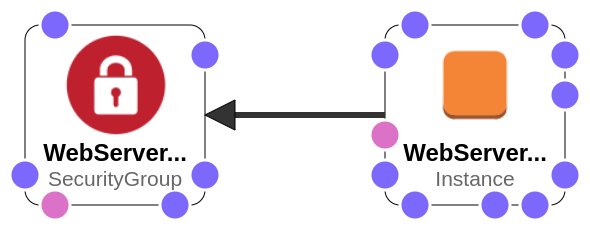
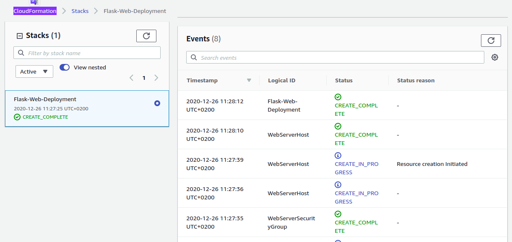
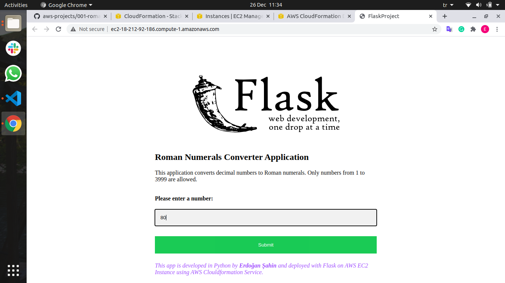
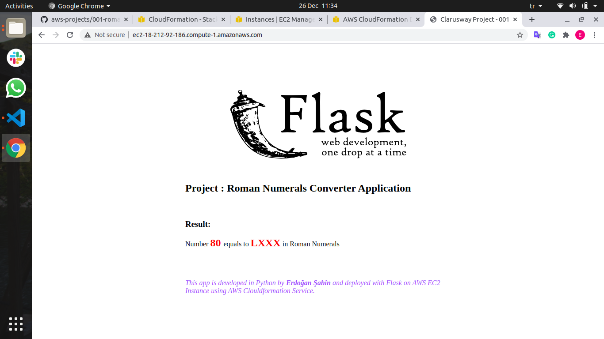

# Roman Numerals Converter Application (Python Flask) deployed on AWS EC2 with Cloudformation

## Description
The Roman Numerals Converter Application aims to convert the given number to the Roman numerals. The application is to be coded in Python and deployed as a web application with Flask on AWS Elastic Compute Cloud (EC2) Instance using AWS Cloudformation Service. 

## Problem Statement


   
```
Roman numerals are represented by seven different symbols: I, V, X, L, C, D and M.
- Symbol       Value
- I             1
- V             5
- X             10
- L             50
- C             100
- D             500
- M             1000
- For example, two is written as II in Roman numeral, just two one's added together. 
Twelve is written as, XII, which is simply X + II. 
The number twenty seven is written as XXVII, which is XX + V + II.
- Roman numerals are usually written largest to smallest from left to right. 
However, the numeral for four is not IIII. Instead, the number four is written as IV. 
Because the one is before the five we subtract it making four. 
The same principle applies to the number nine, which is written as IX. 
There are six instances where subtraction is used:
- I can be placed before V (5) and X (10) to make 4 and 9. 
- X can be placed before L (50) and C (100) to make 40 and 90. 
- C can be placed before D (500) and M (1000) to make 400 and 900.
```

- User input can be either integer or string, thus the input should be checked for the followings,

   - The input should be a decimal number within the range of 1 to 3999, inclusively.
   
   - If the input is less then 1 or greater then 3999, user should be warned using the given html template.

   - If the input is string and can not be converted to decimal number, user should be warned using the given html template.

- Example for user inputs and respective outputs

```
Input       Output
-----       ------
3           III
9           IX
58          LVIII
1994        MCMXCIV
-8          Warning with "Not Valid! Please enter a number between 1 and 3999, inclusively."
4500        Warning with "Not Valid! Please enter a number between 1 and 3999, inclusively."
Ten         Warning with "Not Valid! Please enter a number between 1 and 3999, inclusively."
```

## Cloudformation

- In the development environment, Cloudformation template has using the followings,

   - The application stack should be created with new AWS resources. 

   - The application stack should take the name of your Key Pair as a parameter from the user;

   - The application should run on Amazon Linux 2 EC2 Instance

   - EC2 Instance type can be configured as `t2.micro`.

   - Instance launched by Cloudformation should be tagged `Web Server of StackName` 

   - The Web Application should be accessible via web browser and terminal from anywhere.

   - The Application files should be downloaded from Github repo and deployed on EC2 Instance using user data script within cloudformation template. 

   - Roman Numerals Converter Application Website URL should be given as output by Cloudformation Service, after the stack created.

   

## Project Skeleton 

```
001-roman-numerals-converter (folder)
|
|----readme.md                
|----cfn-template.yml  
|----app.py            
|----templates
        |----index.html  
        |----result.html 
```

## Expected Outcome







### At the end of the project, following topics are to be covered;

- Algorithm design

- Programming with Python 

- Web application programming with Python Flask Framework 

- Bash scripting

- AWS EC2 Service

- AWS Security Groups Configuration

- AWS Cloudformation Service

- AWS Cloudformation Template Design

- Git & Github for Version Control System

## Insallation
  
- Step 1: Download or clone project definition from my repo on Github 

- Step 2: Create project folder for local public repo on your pc

- Step 3: Write the Roman Numerals Converter Application in Python

- Step 4: Transform the application into web application using Python Flask framework

- Step 5: Prepare a cloudformation template to deploy the app on EC2 Instance

- Step 6: Push the application into your own public repo on Github

- Step 7: Deploy the application on AWS Cloud using Cloudformation template to showcase your app


## Resources

- [Python Flask Framework](https://flask.palletsprojects.com/en/1.1.x/quickstart/)

- [Python Flask Example](https://realpython.com/flask-by-example-part-1-project-setup/)

- [AWS Cloudformation User Guide](https://docs.aws.amazon.com/AWSCloudFormation/latest/UserGuide/Welcome.html)